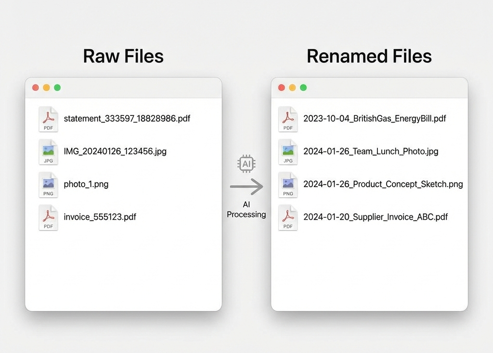

# PDF Renamer - AI-Powered Document Classification

[](LICENSE)
[](https://www.python.org/downloads/)

[]()

Automatically rename PDFs and images using a vision-language model (Qwen2.5-VL) running locally via Ollama. Perfect for organizing document collections without cloud dependencies.

## Features

- **AI-Powered Analysis**: Uses vision models to automatically analyze documents
- **Smart Caching**: Avoid re-analyzing identical documents with persistent SQLite cache
- **Flexible Output**: Preserve directory structure, customize naming patterns
- **Dry Run Mode**: Preview all changes before execution
- **Privacy-First**: All processing happens locally - no cloud uploads
- **Concurrent Processing**: Multi-threaded batch processing for large collections
- **Detailed Logging**: Comprehensive statistics and error reporting

## Why Qwen2.5-VL?

Although Qwen3-VL is available and known to be more advanced, Qwen2.5-VL provides the best balance of speed and accuracy for document analysis tasks. This tool defaults to Qwen2.5-VL for optimal performance, but you can use other models by running `ollama run <model-name>` first.

## Requirements

- **Ollama**: Vision-language model server ([Install Ollama](https://ollama.ai))
- **Python 3.13+**: Runtime environment
- **Poppler**: PDF processing library (system dependency)

## Installation

### Option 1: Download Pre-Built Binary (Easiest)

Download standalone executable from [GitHub Releases](https://github.com/wongws11/pdf-renamer/releases):

**macOS (Intel):**
```bash
tar -xzf pdf-renamer-macos-x86_64.tar.gz
chmod +x pdf-renamer
./pdf-renamer /path/to/pdfs
```

**macOS (Apple Silicon):**
```bash
tar -xzf pdf-renamer-macos-arm64.tar.gz
chmod +x pdf-renamer
./pdf-renamer /path/to/pdfs
```

**Windows:**
```powershell
# Extract pdf-renamer-windows.zip into a folder
Expand-Archive .\pdf-renamer-windows.zip -DestinationPath .\pdf-renamer-windows
cd .\pdf-renamer-windows
.\pdf-renamer.exe "C:\path\to\pdfs"
```

**Linux:**
```bash
tar -xzf pdf-renamer-linux.tar.gz
chmod +x pdf-renamer
./pdf-renamer /path/to/pdfs
```

### Option 2: Install from Source with pip

```bash
pip install git+https://github.com/wongws11/pdf-renamer.git
pdf-renamer /path/to/pdfs
```

### Option 3: Local Development

```bash
# Install Python dependencies
pip install -r requirements.txt

# Install Ollama (if not already installed)
# https://ollama.ai

# Install poppler (required for PDF to image conversion)
# macOS:
brew install poppler

# Ubuntu/Debian:
sudo apt-get install poppler-utils

# Windows: Download from https://github.com/oschwartz10612/poppler-windows/releases/
```

## Setup

1. Start Ollama server:

```bash
ollama run qwen2.5-vl:8b
```

## Usage

### Basic Usage (Dry Run)

```bash
python -m src.pdf_renamer /path/to/pdfs
```

### Execute Rename

```bash
python -m src.pdf_renamer /path/to/pdfs --execute
```

### Recursive Processing

```bash
python -m src.pdf_renamer /path/to/pdfs --recursive --execute
```

### Custom Output Directory

```bash
python -m src.pdf_renamer /path/to/pdfs --output /path/to/output --execute
```

### With Custom Server

```bash
python -m src.pdf_renamer /path/to/pdfs --server http://localhost:11434 --execute
```

### Disable Image Processing

```bash
python -m src.pdf_renamer /path/to/pdfs --no-image --execute
```

### Show Cache Statistics

````bash
python -m src.pdf_renamer --cache-stats
``` to avoid server overload:

   ```bash
   python -m src.pdf_renamer /path/to/large/batch --delay 1.0 --execute
````

2. **Cache Building**: The cache is built on first run. Subsequent runs with similar documents will be much faster thanks to the persistent SQLite database.

3. **Monitor Cache**: Check cache performance with:

   ```bash
   python -m src.pdf_renamer --cache-stats
   ```

## Project Structure

```
pdf-renamer/
├── src/pdf_renamer/          # Main package
│   ├── __init__.py           # Package initialization
│   ├── __main__.py           # CLI entry point
│   ├── cli.py                # Command-line interface and main logic
│   └── pdf_utils.py          # Utility classes for PDF processing
├── requirements.txt          # Python dependencies
├── pyproject.toml           # Project metadata
├── LICENSE                  # MIT License
├── CHANGELOG.md             # Version history
└── README.md               # This file
```

## Architecture

### Core Components

- **PDFRenamer**: Main orchestrator for batch processing
- **LLMAnalyzer**: Manages communication with Ollama server
- **PDFConverter**: Handles PDF to image conversion
- **PDFCache**: SQLite-backed caching with thread-safe connection pooling
- **ResponseParser**: Parses LLM output into structured data
- **FilenameGenerator**: Creates sanitized, organized filenames

### Caching Strategy

The application uses a content-hash based caching system:

1. Files are hashed using SHA256
2. Results are stored in SQLite with metadata
3. Identical files are recognized and reused
4. Renamed files are tracked to prevent re-processing

## Troubleshooting

### Ollama Connection Error

```
ERROR: Cannot connect to Ollama!
Make sure it's running at http://127.0.0.1:11434
```

**Solution**: Start Ollama server in another terminal:

```bash
ollama serve
```

### No Models Available

```
ERROR: No models found in Ollama!
Pull a model first with: ollama pull qwen2-vl
```

**Solution**: Pull a vision model:

```bash
ollama pull qwen2.5-vl:8b
```

### PDF Conversion Errors

**Solution**: Ensure poppler is installed correctly:

```bash
# macOS
brew reinstall poppler

# Ubuntu/Debian
sudo apt-get install --reinstall poppler-utils
```

## License

This project is licensed under the MIT License - see [LICENSE](LICENSE) file for details.

## Acknowledgments

- [Ollama](https://ollama.ai) - For providing accessible local LLM serving
- [Qwen2.5-VL](https://huggingface.co/Qwen/Qwen2.5-VL) - For excellent vision-language capabilities
- [Pillow](https://python-pillow.org/) - For image processing
- [pdf2image](https://github.com/Belval/pdf2image) - For PDF conversion
  ```bash
  python -m src.pdf_renamer /path/to/large/batch --delay 1.0 --execute
  ```

2. **Disable Cache Initially to Build It Efficiently**:
   The cache is built on first run. Subsequent runs with similar documents will be much faster.

3. **Use Recursive Mode for Organized Folders**:

   ```bash
   python -m src.pdf_renamer /path/to/pdfs --recursive --execute
   ```

4. **Pre-warm Cache**:
   Run a dry run first to generate cache without making changes.

### Cache Management

- Cache location: `pdf_cache.db` (default)
- Custom cache path: `--cache-path /path/to/cache.db`
- Disable cache: `--no-cache`
- View cache: `--cache-stats`

### Server Configuration

The cache uses SQLite with WAL mode and NORMAL synchronous mode for better performance:

- WAL mode allows concurrent reads during writes
- NORMAL mode balances safety and performance
- Connection pooling reduces connection overhead

## Command Line Options

```
usage: main.py [-h] [-o OUTPUT] [-e] [-r] [-s SERVER] [-v] [-d DELAY]
               [-w WORKERS] [--save-log SAVE_LOG] [--no-cache]
               [--cache-path CACHE_PATH] [--cache-stats] [--no-image]
               input_path

Automatically rename PDFs using vision model

positional arguments:
  input_path            Input directory or PDF/JPG file path

optional arguments:
  -h, --help            show this help message and exit
  -o, --output OUTPUT   Output directory for renamed files
  -e, --execute         Actually rename files (default is dry-run)
  -r, --recursive       Recursively process PDFs in subdirectories
  -s, --server SERVER   Ollama server URL (default: http://127.0.0.1:11434)
  -v, --verbose         Enable verbose logging
  -d, --delay DELAY     Delay between files in seconds (default: 0.5)
  -w, --workers WORKERS Number of worker threads (default: 4)
  --save-log SAVE_LOG   Save results to JSON file
  --no-cache            Disable cache (re-analyze all PDFs)
  --cache-path PATH     Path to cache database (default: pdf_cache.db)
  --cache-stats         Show cache statistics and exit
  --no-image            Exclude JPG and PNG files from processing
```

## Output Format

Generated filenames follow this pattern:

```
[YYYY-MM-DD_]Description_ID[_vN].ext
```

Examples:

- `2024-07-12_Kwik Fit Invoice_147218533.pdf`
- `Insurance Policy_POL-2023-5678.pdf`
- `2024-01-15_Bank Statement_ACC123456_v2.pdf` (duplicate handling)

## Examples

### Example 1: Dry run on a directory

```bash
python -m src.pdf_renamer ~/Downloads/invoices
```

### Example 2: Process recursively with custom server

```bash
python -m src.pdf_renamer ~/Documents/scans --recursive --server http://192.168.1.100:11434 --execute
```

### Example 3: Process and move to organized output

```bash
python -m src.pdf_renamer ~/raw_documents --output ~/organized_documents --recursive --execute --verbose
```

### Example 4: Process and save results

```bash
python -m src.pdf_renamer ~/batch --execute --save-log results.json
```

## License

MIT
